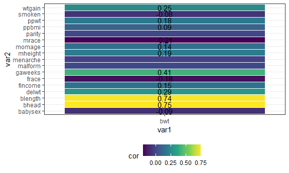
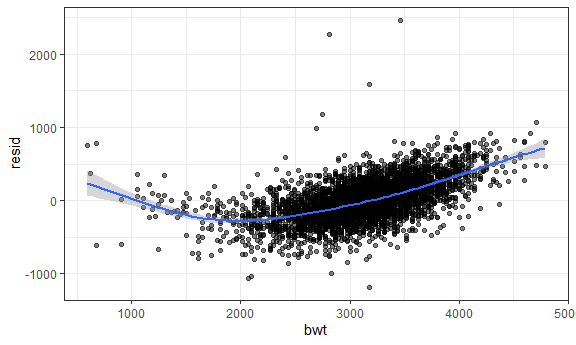
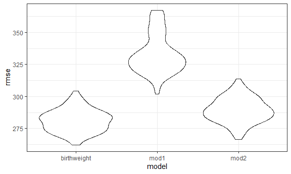

p8105\_hw6\_ew2717
================
Eric Wang

    ## Warning: package 'ggcorrplot' was built under R version 4.1.2

    ## Warning: package 'rstatix' was built under R version 4.1.2

## Problem 1

#### Loading and cleaning the data set

``` r
birthweight_df <- 
  read_csv("data/birthweight.csv") %>%
  janitor::clean_names()
```

    ## Rows: 4342 Columns: 20

    ## -- Column specification --------------------------------------------------------
    ## Delimiter: ","
    ## dbl (20): babysex, bhead, blength, bwt, delwt, fincome, frace, gaweeks, malf...

    ## 
    ## i Use `spec()` to retrieve the full column specification for this data.
    ## i Specify the column types or set `show_col_types = FALSE` to quiet this message.

#### Checking for missing data

``` r
skimr::skim(birthweight_df)$n_missing
```

    ##  [1] 0 0 0 0 0 0 0 0 0 0 0 0 0 0 0 0 0 0 0 0

As seen above, there are no missing values for any of the variables in
this data set.

#### Creating matrix

``` r
birthweight_df %>% 
  cor_mat() %>% 
  cor_gather() %>% 
  filter(var1 %in% c("bwt")) %>% 
  filter(!var2 %in% c("bwt")) %>% 
  mutate(
    sig_p = ifelse(p < 0.01, T, F),
    p_if_sig = ifelse(p < 0.01, p, NA),
    r_if_sig = ifelse(p < 0.01, cor, NA)
  ) %>% 
  ggplot(aes(
    x = var1, 
    y = var2, 
    fill = cor,
    label = round(r_if_sig, 2))) + 
  geom_tile(color = "white") +  
  scale_x_discrete() + 
  geom_text()
```



#### Converting numeric to factor

``` r
birthweight_df <-
  birthweight_df %>%
  mutate(babysex = recode(babysex,
                          '1' = 'male',
                          '2' = 'female'),
         babysex = factor(babysex, levels = c('male', 'female')),
         frace = recode(frace,
                        '1' = 'White',
                        '2' = 'Black',
                        '3' = 'Asian',
                        '4' = 'Puerto Rican',
                        '8' = 'Other',
                        '9' = 'Unknown'), 
         frace = factor(frace, levels = c('White', 'Black', 'Asian', 'Puerto Rican', 'Other')),
         malform = recode(malform,
                          '0' = 'absent',
                          '1' = 'present'),
         malform = factor(malform, levels = c('absent', 'present')), 
         mrace = recode(mrace,
                        '1' = 'White',
                        '2' = 'Black',
                        '3' = 'Asian',
                        '4' = 'Puerto Rican',
                        '8' = 'Other'), 
         mrace = factor(mrace, levels = c('White', 'Black', 'Asian', 'Puerto Rican', 'Other')))
```

Babysex, frace, malform, and mrace are the four categorical variables in
this data set that should be converted to factor variables.

#### Finding rows and columns

``` r
rows = birthweight_df %>% nrow()
columns = birthweight_df %>% ncol()
```

There are *4342* rows and *20* columns in this data set.

# My Proposed Regression Model

``` r
birthweight_model <- 
  lm(bwt ~ fincome + mrace + smoken + momage + mheight + bhead + blength, 
     data = birthweight_df)
```

``` r
#obtaining a quick summary of the model and for cleaning up the coefficient table using broom
birthweight_model %>%
  broom::tidy() %>%
  select(term, estimate, p.value) %>% 
  knitr::kable(digits = 6)
```

| term              |     estimate |  p.value |
|:------------------|-------------:|---------:|
| (Intercept)       | -6202.455681 | 0.000000 |
| fincome           |     0.280006 | 0.126458 |
| mraceBlack        |  -136.204636 | 0.000000 |
| mraceAsian        |  -103.559262 | 0.017453 |
| mracePuerto Rican |  -106.672090 | 0.000000 |
| smoken            |    -4.284320 | 0.000000 |
| momage            |     0.573692 | 0.634956 |
| mheight           |    11.168473 | 0.000000 |
| bhead             |   139.118799 | 0.000000 |
| blength           |    80.138083 | 0.000000 |

*Analysis:*

1.  **Intercept Estimate** Does not make sense because intercept is
    meaningful interpretation if it is reasonable that X1 and X2 and etc
    can be zero. Mother’s pre-pregnancy BMI can not be zero or bhead can
    not be 0 or blenght can not be 0 either.

2.  **fincome - (Family Monthly Income in Hundreds)** The slope in term
    in our model is saying that for every 100 hundred dollar increase in
    the family monthly income, the baby birth weight goes by up 0.42
    keeping every other variable constant.

3.  **mraceBlack** This is a categorical variable. Compared to Mother
    Race: White, we would expect baby birthweight on average to be
    134.73 less for Mother Race: Black keeping every other variables
    constant.

4.  **mraceAsian** This is a categorical variable. Compared to Mother
    Race: White, we would expect baby birthweight on average to be 73.87
    less for Mother Race: Asian keeping every other variable constant.

5.  **mracePuerto Rican** This is a categorical variable. Compared to
    Mother Race: White, we would expect baby birthweight on average to
    be 135.33 less for Mother Race: Puerto Rican keeping every other
    variables constant.

6.  **mheight - Mother’s height** The slope in term in our model is
    saying that for every 1 increase in the mheight, the baby birth
    weight goes by up 11.16 keeping every other variable constant.

7.  **smoken - average number of cigarettes smoked per day during
    pregnancy** The slope in term in our model is saying that for every
    1 increase in smoking per day, the baby birth weight down by up
    4.06.

8.  **momage - Mother’s age at delivery (years)** The slope in term in
    our model is saying that for every 1 increase in age year for
    mother, the baby birth weight goes up by 0.66 keeping other variable
    constant.

9.  **bhead: Baby’s head circumference at birth (centimeters)** The
    slope in term in our model is saying that for every 1 increase in
    centimeters for baby’s head circumference at birth, the baby’s birth
    weight goes up by 138.73 keeping every other variable constant.

10. **blenght: Baby’s length at birth (circumference)** The slope in
    term in our model is saying that for every 1 increase in centimeters
    for baby’s length at birth, the baby’s birth goes up by 81.55
    keeping other variable constant.

# Plot of my model residuals against fitted values

``` r
birthweight_df %>% 
  add_predictions(birthweight_model) %>% 
  add_residuals(birthweight_model) %>%
  ggplot(aes(x = bwt, 
             y = resid)) +
  geom_point(alpha = 0.5) +
  geom_smooth()
```

    ## `geom_smooth()` using method = 'gam' and formula 'y ~ s(x, bs = "cs")'



# Compare my model to two others (The predictors were specified in the assignment guideline (pdf):

``` r
model_1 <- lm(bwt ~ blength + gaweeks, data = birthweight_df)
model_2 <- lm(bwt ~ bhead + blength + babysex + bhead*blength + bhead*babysex +  + bhead*blength*babysex, data = birthweight_df)
```

``` r
cv_df <-
  crossv_mc(birthweight_df, 100) %>% 
  mutate(
    birthweight_model = map(train, ~lm(bwt ~ fincome + mrace + ppbmi + smoken + momage + bhead + blength, data = .x)),
    model_1 = map(train, ~lm(bwt ~ blength + gaweeks, data = .x)),
    model_2 = map(train, ~lm(bwt ~ bhead + blength + babysex + bhead*blength + bhead* babysex + blength*babysex + bhead * blength * babysex, data = .x))) %>% 
  mutate(
    rmse_birthweight = map2_dbl(birthweight_model, test,  ~rmse(model = .x, data = .y)),
    rmse_mod1 = map2_dbl(model_1, test, ~rmse(model = .x, data = .y)),
    rmse_mod2 = map2_dbl(model_2, test, ~rmse(model = .x, data = .y)))
```

``` r
cv_df %>% 
  select(starts_with("rmse")) %>% 
  pivot_longer(
    everything(),
    names_to = "model", 
    values_to = "rmse",
    names_prefix = "rmse_") %>% 
  mutate(model = 
           fct_inorder(model)) %>% 
  ggplot(aes(x = model, 
             y = rmse)) + 
  geom_violin()
```



## Problem 2

load data

``` r
weather_df = 
  rnoaa::meteo_pull_monitors(
    c("USW00094728"),
    var = c("PRCP", "TMIN", "TMAX"), 
    date_min = "2017-01-01",
    date_max = "2017-12-31") %>%
  mutate(
    name = recode(id, USW00094728 = "CentralPark_NY"),
    tmin = tmin / 10,
    tmax = tmax / 10) %>%
  select(name, id, everything())
```

    ## Registered S3 method overwritten by 'hoardr':
    ##   method           from
    ##   print.cache_info httr

    ## using cached file: C:\Users\heric\AppData\Local/Cache/R/noaa_ghcnd/USW00094728.dly

    ## date created (size, mb): 2021-12-02 23:49:27 (7.629)

    ## file min/max dates: 1869-01-01 / 2021-11-30

### Bootstrap

Use 5000 bootstrap samples and, for each bootstrap sample, produce
estimates of these two quantities

``` r
weather_boot = 
  weather_df %>% 
  modelr::bootstrap(n = 5000) %>% 
  mutate(
    models = map(strap, ~lm(tmax ~ tmin, data = .x) ),
    results_log = map(models, broom::tidy),
    results_r = map(models, broom::glance)
    ) %>% 
  select(-strap, -models) %>% 
  unnest(results_r) %>% 
  select(.id, results_log, r.squared) %>% 
  unnest(results_log) %>% 
  group_by(.id) %>% 
  summarize(
    r.squared = r.squared,
    log = log(prod(estimate))
    ) %>% 
  unique() %>% 
  ungroup()
```

    ## `summarise()` has grouped output by '.id'. You can override using the `.groups` argument.

**Distribution of r squared estimates**

``` r
weather_boot %>% 
  ggplot(aes(x = r.squared)) + 
  geom_density() +
  labs(
    title = "Distribution of r squared esitimates",
    x = "r squared estimates")
```


From the plot, we see that the r squared estimates mostly lays around
0.9. The distribution is left-skewed.

**Distribution of log(beta0 \* beta1) estimates**

``` r
weather_boot %>% 
  ggplot(aes(x = log)) + 
  geom_density() +
  labs(
    title = "Distribution of log(beta0 * beta1) esitimates",
    x = "log(beta0 * beta1) estimates")
```


From the plot, we see that the log(beta0 \* beta1) estimates mostly lays
around 2.01. It is overall normally distributed.

**95% Confidence interval for r.squared**

``` r
weather_boot %>%
  summarise(lower = quantile(r.squared, probs = c(0.025)),
            upper = quantile(r.squared, probs = c(0.975))
            ) %>% 
  knitr::kable()
```

|     lower |     upper |
|----------:|----------:|
| 0.8943103 | 0.9274413 |

**95% Confidence interval for log(beta0 \* beta1)**

``` r
weather_boot %>%
  summarise(lower = quantile(log, probs = c(0.025)),
            upper = quantile(log, probs = c(0.975))
            ) %>% 
  knitr::kable()
```

|    lower |    upper |
|---------:|---------:|
| 1.964379 | 2.059173 |
