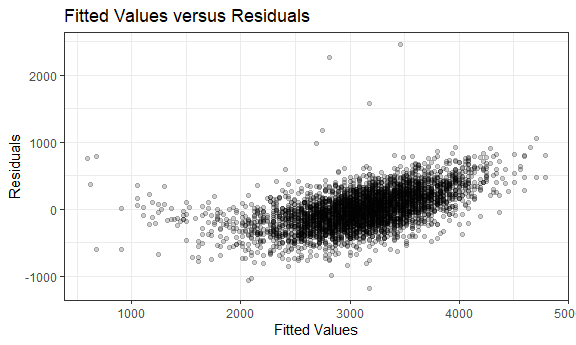

p8105\_hw6\_ew2717
================
Eric Wang

## Problem 1

#### Loading and cleaning the data set

``` r
birthweight_df <- 
  read_csv("data/birthweight.csv") %>%
  janitor::clean_names()
```

    ## Rows: 4342 Columns: 20

    ## -- Column specification --------------------------------------------------------
    ## Delimiter: ","
    ## dbl (20): babysex, bhead, blength, bwt, delwt, fincome, frace, gaweeks, malf...

    ## 
    ## i Use `spec()` to retrieve the full column specification for this data.
    ## i Specify the column types or set `show_col_types = FALSE` to quiet this message.

#### Checking for missing data

``` r
skimr::skim(birthweight_df)$n_missing
```

    ##  [1] 0 0 0 0 0 0 0 0 0 0 0 0 0 0 0 0 0 0 0 0

As seen above, there are no missing values for any of the variables in
this data set.

#### Finding rows and columns

``` r
rows <- 
  birthweight_df %>% 
  nrow()
columns <- 
  birthweight_df %>% 
  ncol()
```

There are 4342 rows and 20 columns in this data set.

#### Creating matrix

``` r
birthweight_df %>% 
  cor_mat() %>% 
  cor_gather() %>% 
  filter(var1 %in% c("bwt")) %>% 
  filter(!var2 %in% c("bwt")) %>% 
  mutate(
    sig_p = ifelse(p < 0.01, T, F),
    p_if_sig = ifelse(p < 0.01, p, NA),
    r_if_sig = ifelse(p < 0.01, cor, NA)
  ) %>% 
  ggplot(aes(
    x = var1, 
    y = var2, 
    fill = cor,
    label = round(r_if_sig, 2))) + 
  geom_tile(color = "white") +  
  scale_x_discrete() + 
  geom_text()
```


#### Converting numeric to factor

``` r
birthweight_df <-
  birthweight_df %>%
  mutate(babysex = recode(babysex,
                          '1' = 'male',
                          '2' = 'female'),
         babysex = factor(babysex, levels = c('male', 'female')),
         frace = recode(frace,
                        '1' = 'White',
                        '2' = 'Black',
                        '3' = 'Asian',
                        '4' = 'Puerto Rican',
                        '8' = 'Other',
                        '9' = 'Unknown'), 
         frace = factor(frace, levels = c('White', 'Black', 'Asian', 'Puerto Rican', 'Other')),
         malform = recode(malform,
                          '0' = 'absent',
                          '1' = 'present'),
         malform = factor(malform, levels = c('absent', 'present')), 
         mrace = recode(mrace,
                        '1' = 'White',
                        '2' = 'Black',
                        '3' = 'Asian',
                        '4' = 'Puerto Rican',
                        '8' = 'Other'), 
         mrace = factor(mrace, levels = c('White', 'Black', 'Asian', 'Puerto Rican', 'Other')))
```

Babysex, frace, malform, and mrace are the four categorical variables in
this data set that should be converted to factor variables.

#### Proposing regression model

``` r
birthweight_model <- 
  lm(bwt ~ fincome + mrace + smoken + momage + mheight + bhead + blength, 
     data = birthweight_df)
```

My proposed regression model has a modeling process that uses
correlations based on the p-value, then selected predictors that had
significant correlations with the outcome. These values were then
included in my model.

#### Plotting of model residuals against fitted values

``` r
birthweight_df %>% 
  add_predictions(birthweight_model) %>% 
  add_residuals(birthweight_model) %>%
  ggplot(aes(x = bwt, 
             y = resid)) +
  geom_point(alpha = 0.2) +
  labs(
    x = "Fitted Values",
    y = "Residuals",
    title = "Fitted Values versus Residuals")
```



#### Comparing model to two others

``` r
model_one <- lm(bwt ~ blength + gaweeks, data = birthweight_df)
model_two <- lm(bwt ~ bhead + blength + babysex + bhead*blength + bhead*babysex +  + bhead*blength*babysex, data = birthweight_df)
```

``` r
cv_df <-
  crossv_mc(birthweight_df, 100) %>% 
  mutate(
    birthweight_model = map(train, ~lm(bwt ~ fincome + mrace + ppbmi + smoken + momage + bhead + blength, 
                                       data = .x)),
    model_one = map(train, ~lm(bwt ~ blength + gaweeks, data = .x)),
    model_two = map(train, ~lm(bwt ~ bhead + blength + babysex + bhead*blength + bhead* babysex + blength*babysex + bhead * blength * babysex, 
                               data = .x))) %>% 
  mutate(
    rmse_birthweight = map2_dbl(birthweight_model, test,  ~rmse(model = .x, 
                                                                data = .y)),
    rmse_mod1 = map2_dbl(model_one, test, ~rmse(model = .x, 
                                                data = .y)),
    rmse_mod2 = map2_dbl(model_two, test, ~rmse(model = .x, 
                                                data = .y)))
```

``` r
cv_df %>% 
  select(starts_with("rmse")) %>% 
  pivot_longer(
    everything(),
    names_to = "model", 
    values_to = "rmse",
    names_prefix = "rmse_") %>% 
  mutate(model = 
           fct_inorder(model)) %>% 
  ggplot(aes(x = model, 
             y = rmse)) + 
  geom_violin() +
  labs(
    title = "Models versus Root Mean Square Error",
    x = "Models",
    y = "Root Mean Square Error"
  )
```


## Problem 2

#### Loading and cleaning the data set

``` r
weather_df = 
  rnoaa::meteo_pull_monitors(
    c("USW00094728"),
    var = c("PRCP", "TMIN", "TMAX"), 
    date_min = "2017-01-01",
    date_max = "2017-12-31") %>%
  mutate(
    name = recode(id, USW00094728 = "CentralPark_NY"),
    tmin = tmin / 10,
    tmax = tmax / 10) %>%
  select(name, id, everything())
```

    ## Registered S3 method overwritten by 'hoardr':
    ##   method           from
    ##   print.cache_info httr

    ## using cached file: C:\Users\heric\AppData\Local/Cache/R/noaa_ghcnd/USW00094728.dly

    ## date created (size, mb): 2021-12-02 23:49:27 (7.629)

    ## file min/max dates: 1869-01-01 / 2021-11-30

#### Finding rows and columns

``` r
weather_rows <- 
  weather_df %>%
  nrow()
weather_columns <- 
  weather_df %>%
  ncol()
```

There are 365 rows and 6 columns in this data set.

#### Using 5000 bootstrap samples and producing estimates of these two quantities

``` r
weather_bootstrap = 
  weather_df %>% 
  bootstrap(n = 5000) %>% 
  mutate(
    models = map(strap, ~lm(tmax ~ tmin, 
                            data = .x) ),
    results_log = map(models, 
                      broom::tidy),
    results_r = map(models, 
                    broom::glance)
    ) %>% 
  select(-strap, -models) %>% 
  unnest(results_r) %>% 
  select(.id, results_log, r.squared) %>% 
  unnest(results_log) %>% 
  group_by(.id) %>% 
  summarize(
    r.squared = r.squared,
    log = log(prod(estimate))
    ) %>% 
  unique() %>% 
  ungroup()
```

    ## `summarise()` has grouped output by '.id'. You can override using the `.groups` argument.

#### Finding the distribution of r squared estimates

``` r
weather_bootstrap %>% 
  ggplot(aes(x = r.squared)) + 
  geom_density() +
  labs(
    title = "R Squared Esitimates versus Density",
    x = "R Equared Estimates")
```


#### Finding the distribution of log of the product of the betas

``` r
weather_bootstrap %>% 
  ggplot(aes(x = log)) + 
  geom_density() +
  labs(
    title = "Log of the Product of Betas versus Density",
    x = "Log of the Product of the Betas")
```


#### Finding 95% Confidence interval for r-squared value

``` r
weather_bootstrap %>%
  summarise(lower = quantile(r.squared, 
                             probs = c(0.025)),
            upper = quantile(r.squared, 
                             probs = c(0.975)))
```

    ## # A tibble: 1 x 2
    ##   lower upper
    ##   <dbl> <dbl>
    ## 1 0.894 0.927

The 95% confidence interval for the r-squared value is (0.89, 0.93).

#### Finding 95% Confidence interval for log of the product of the betas

``` r
weather_bootstrap %>%
  summarise(lower = quantile(log, 
                             probs = c(0.025)),
            upper = quantile(log, 
                             probs = c(0.975)))
```

    ## # A tibble: 1 x 2
    ##   lower upper
    ##   <dbl> <dbl>
    ## 1  1.96  2.06

The 95% confidence interval for the log of the product of the betas is
(1.96, 2.06).
